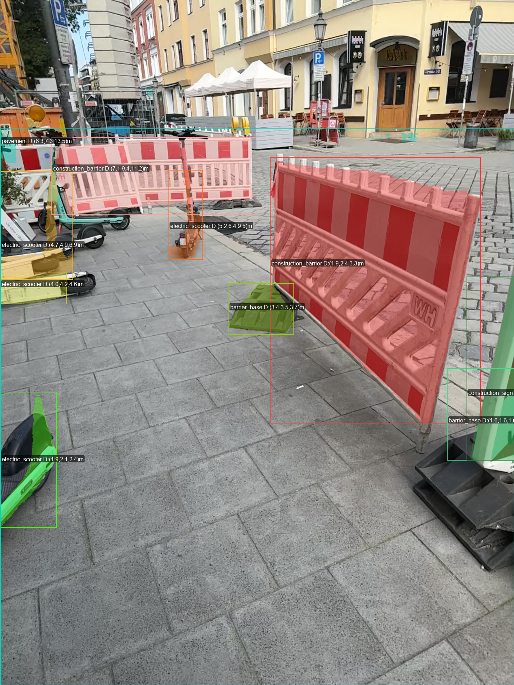
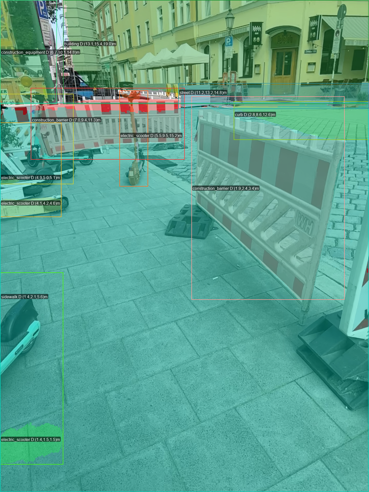
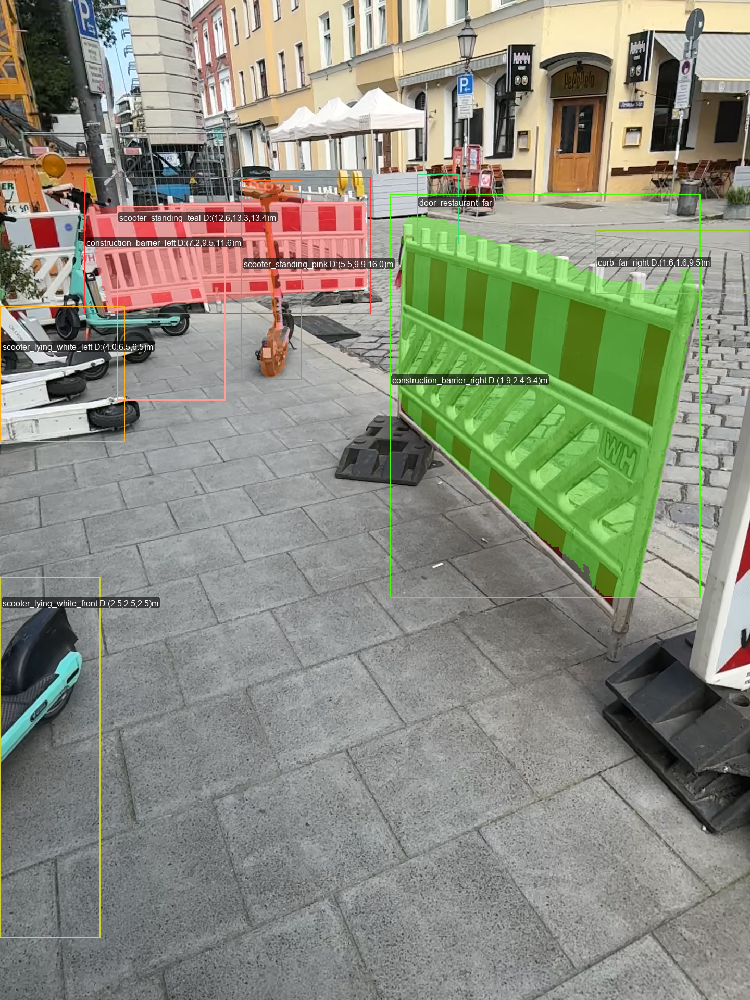
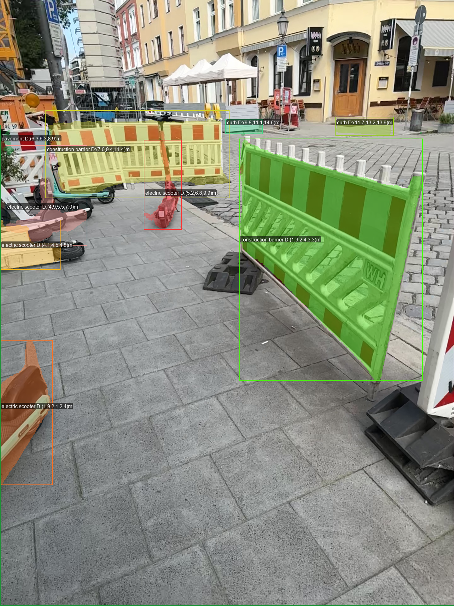
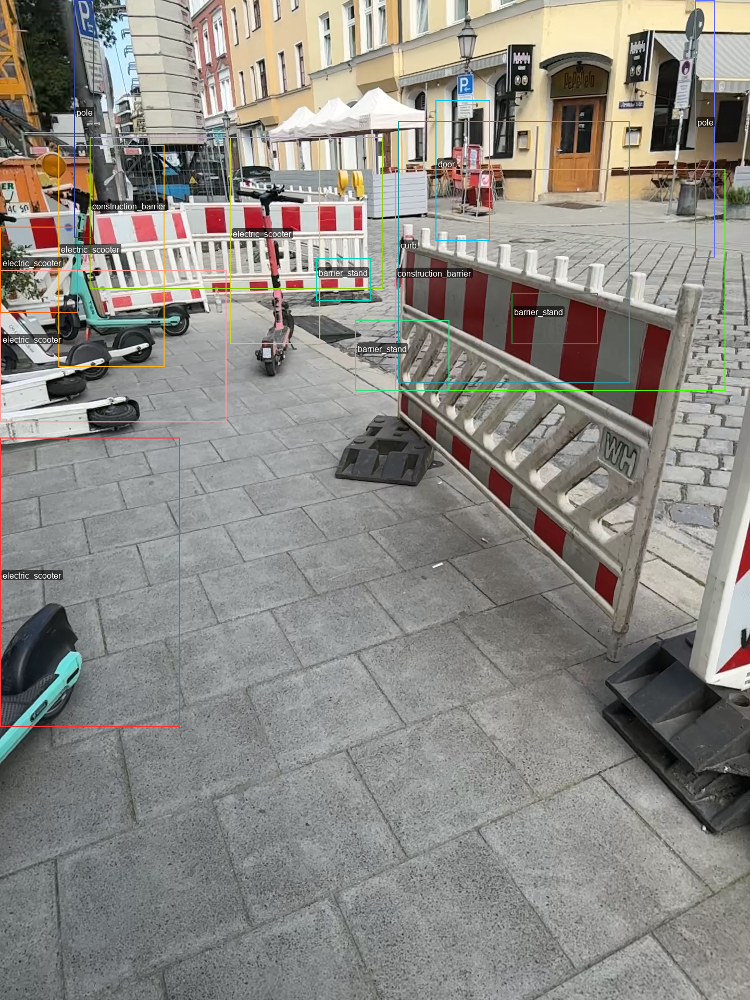

## Week 10: May 26 - May 30, 2025

### Tasks Worked On

- Fixed issue of invalid segmentation masks. **NEVER METION** that it's gonna be a `base64 png str`. The model doesn't know about that, as it is some internal post-processing step.
- **Main Scripts and Degree Computation**: Developed main scripts to run  spatial guidance components:
  - Enhanced `aabb_segmentation.py` with median based depth computation.
  - Created `obb_detection.py` with rotation angle computation for oriented bounding boxes
  - Implemented degree computation in `detection_visualizer.py` for clock-position based spatial descriptions
  - Created `test_gemini.py` and `test_gemini_obb.py` - are main scripts to run each detection algorithm and compute the degree of the spatial guidance description.
  - **Pydantic Schemas for Output Parsing:** Implemented a two-step parsing process for Gemini's structured output:
    - First, parse the raw JSON response into a Pydantic model, this is used to generate the output schema
    - Then, extract relevant fields into a simplified schema for easier processing, here all the further geom fields will be added
    - Implemented `RawAABBDetSeg` and `RawOBBDetection` as the target schemas for Gemini's structured output.
- Implemented GeminiSceneDescriptor stage (grounded in AABB detections depth + angles). Created a new Data Contract for the scene description:
- Moved the different stages into the ZenML pipeline

- **Segmentation Analysis**: Analysed issues of Gemini 2.5 Pro segmentation capabilities, inconsistencies in mask generation across different temperature settings.

**Figure**: Gemini 2.5 Pro segmentation at temperature = 0.1 (default prompt), missing a few segmentation masks. Quality ok

**Figure**: Additional segmentation example at temperature = 0.1. Utter bullshit

**Figure**: Missing segmentation masks at temperature = 0.1.

**Figure**: Gemini 2.5 Pro segmentation at temperature = 0.5 (default prompt).Relatively good consistency

**Figure**: Segmentation results at temperature = 0.5 using a complex prompt -> model fails completely to provide valid segmentation masks, all bboxes are off -> **USE SIMPLE PROMPTS**

- **Async Implementation**: Experimented with asynchronous processing for `gemini_aabb_detection.py` and `gemini_obb_detection.py` to allow for "batched" requests / ensembles. But thsis turned out to be too complicated. This should allow to overcome the inconsitnecies by simply being able to select from multiple candidates or even merge them with some sort of voting mechanism.
- **Example Notebooks**: Created three comprehensive notebooks demonstrating system capabilities (out of previously created cluttered notebooks):
  - `Spatial_understanding_3d_ours.ipynb`: 3D spatial understanding pipeline with depth integration
  - `gemini_aabb_segmentation.ipynb`: AABB detection workflow with segmentation processing
  - `gemini_obb.ipynb`: Oriented bounding box detection with rotation computation

### Problems Encountered

- **JSON Serialization Error**: Encountered `TypeError: Object of type bytes is not JSON serializable` in `GeminiLiveAgent` when transmitting frame context. That came from inproper handling of the `types.Bytes` in `types.Part`
- **Segmentation Inconsistency**: Gemini 2.5 Pro failed to generate segmentation masks for certain objects despite successful detection, suggesting model limitations.
- **Async Complexity**: Implementing async processing for API requests requires careful management of concurrent requests.

### Plans for Next Week

- Develop robust clock orientation calculations for spatial guidance descriptions.
- Define comparison metrics for detection accuracy and segmentation quality.
- Label scenes with ground truth bounding boxes and segmentation masks for evaluation.
- Explore fine-tuning strategies for improved mask generation consistency.

### Time Spent

| Task                               | Time Spent |
|------------------------------------|-----------:|
| Main scripts and degree computation |  2.5 hours |
| Segmentation analysis              |  0.5 hours |
| Async implementation               |  3.0 hours |
| Example notebooks                  |  1.0 hours |
| **Total**                          | **8.0 hours** |