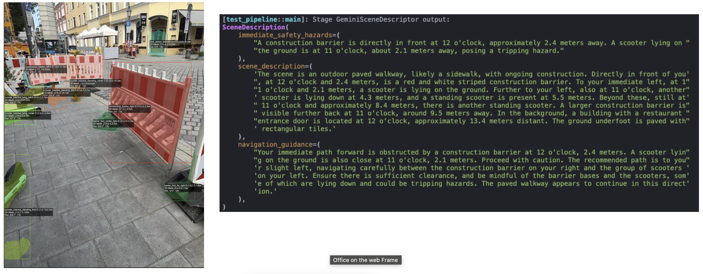
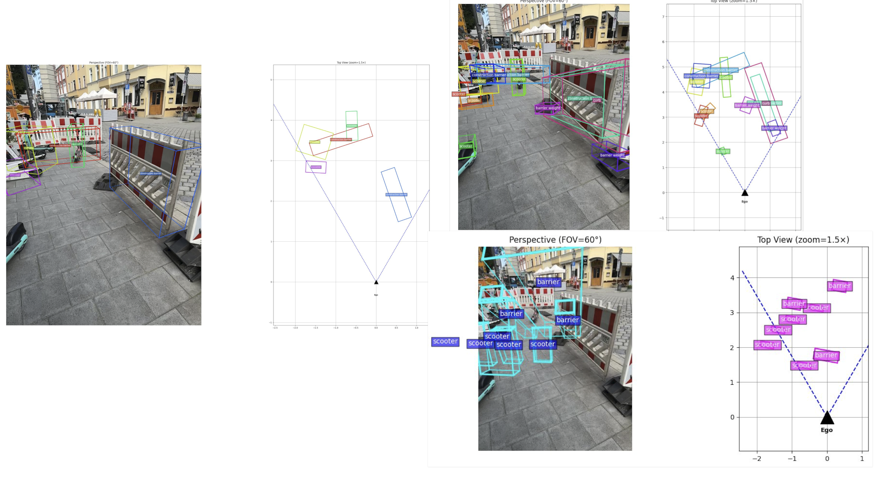
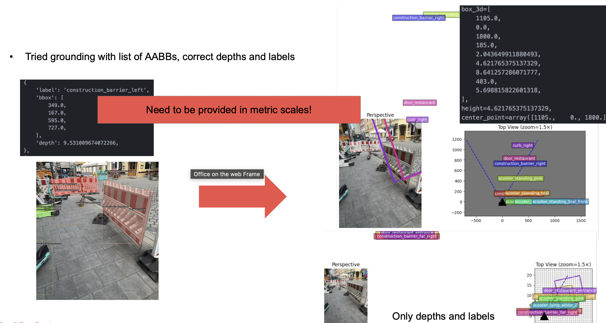
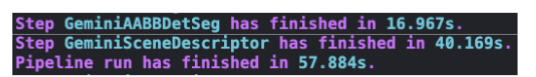

## Week 11 - June 02 - June 06, 2025

### Tasks Worked On

- Implemented structured output parsing for ​OBB detection.​
    - Use camera params for projections.​
    - Improve BEV visualization.
- Tested 2.0 flash vs 2.5 Pro vs 2.0 flash​ for OBB detection.​
- Tried grounding the detection​ by providing the depth extracted via `AABBSegmentation` with the prompt.
- **Data Contracts Refactoring**: Comprehensive update of data contracts system:
  - Experiemented w/ various system prompts and​ modified the json schema​
  - Enhanced `aabb_segmentation.py` with improved validation and 3D bounding box processing:
  - Added `obb_segmentation.py` for oriented bounding box segmentation. The final structured output will have the following fields:
    ```py
    class OBBDetection(DataModel):
    """Processed OBB detection with derived attributes.
    For 3D OBB, 'vertices' would represent the 8 corners of the 3D box.
    """

    label: str
    """Label of the detected object."""

    box_3d: List[float]
    """3D bounding box parameters: [x_center, y_center, z_center, x_size, y_size, z_size, roll, pitch, yaw]."""

    height: Optional[float] = Field(None)
    """Height of the 3D bounding box (z_size), in meters (m)."""

    center_point: Optional[np.ndarray] = Field(None)
    """Center point of the bounding box in world coordinates [x, y, z], shape (3,), in meters."""

    center_distance: Optional[float] = Field(None)
    """Distance from the ego origin to the box center projected onto ground plane, in meters (m).
    This represents the 2D Euclidean distance on the XY plane."""

    euler_matrix: Optional[np.ndarray] = Field(None)
    """3x3 rotation matrix derived from the roll, pitch, yaw angles of the box."""

    obb_vertices_3d: Optional[np.ndarray] = Field(None)
    """8 corner vertices of the 3D bounding box in world coordinates, shape (8, 3)."""

    obb_vertices_2d: Optional[np.ndarray] = Field(None)
    """Projected 3D OBB vertices onto the 2D image plane, shape (8, 2). Equiv. to pts2d as returned from project_to_image in the notebook."""

    obb_vertices_depth: Optional[np.ndarray] = Field(None)
    """Depth values for each projected vertex in the 2D image, shape (8,). Equiv. to depths as returned from project_to_image in the notebook."""

    bev_footprint: Optional[np.ndarray] = Field(None)
    """BEV (Bird's-Eye View) 2D OBB as 4 corner vertices in (x, y) meters."""

    bev_xlim: List[float] = Field(default_factory=list)
    """X limits of the BEV bounding box in meters, shape (2,)."""

    bev_ylim: List[float] = Field(default_factory=list)
    """Y limits of the BEV bounding box in meters, shape (2,)."""

    bev_area: Optional[float] = Field(None)
    """Area of the bounding box footprint on the ground plane after yaw rotation, in square meters (m²).
    Calculated using the Shoelace formula on the XY projection of the box."""

    processed_: bool = Field(False)
    """Indicates whether image-dependent processing has been completed.
    This flag is set to True after the process() method has successfully run."""
    ```
  - Updated `scene_description.py` for better scene representation:
    - `gemini_scene_descriptor.py`: Enhanced scene description generation with contextual awareness from both AABB and OBB detections
    
  - Improved integration of all stages into the ZenML pipeline.


### Problems Encountered
- Small inconsistencies in the Schema / System prompt result in stark differences in the output quality. Even with the 2.0 model the results were not really usable anymoe:


**Figure**: 2.0 flash OBB detections (left, one good of many tries) and BEV visualization. Angles are quite off when using 2.5 with the same parameters and prompt (results on the right).
- Tried resizing the image (no effect).
- Seems that it only works with 2.0 and for single objects!


**Figure**: OBB grounding output using providing the model with dpeth and or AABB detections. Both made the results worse (model can not generalize to being provided these information for the OBB detection task). Providing AABB is worse as these are normalized to [0, 1000] and the OBB detection operates in metric units.

Turns out that this stupid ZenML pipeline has hard real-time capabilities (yikes!):


### Plans for Next Week

- Get grounded and zero-shot scene descriptions and compare them.​
- Compare different approaches with own metrics​
​- Finalize approach and make pipeline ready for testing​.

​

### Time Spent

| Task                               | Time Spent |
|------------------------------------|-----------:|
| OBB processing & plotting  |  5.0 hours |
| Data contract refactoring, Schema gen + viz        |  3 hours |
| Prompt engineering and testing |  1.5 hours |
| Improved Scene Description Generation |  0.5 hours |
| Pipeline integration and testing |  1.5 hours |
| **Total**                          | **11.5 hours** |
