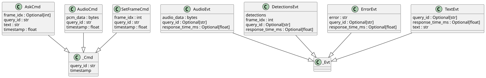
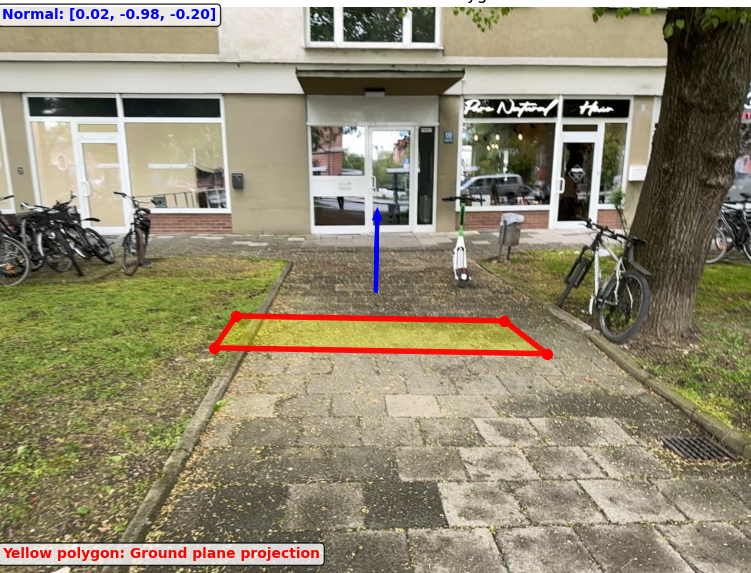
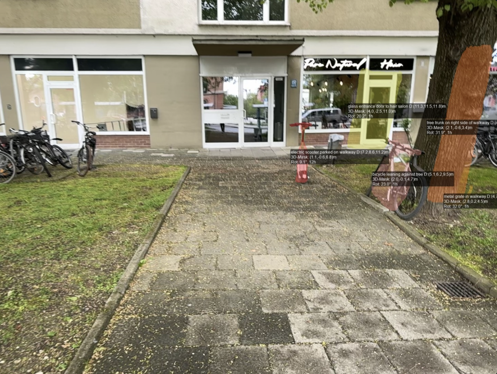
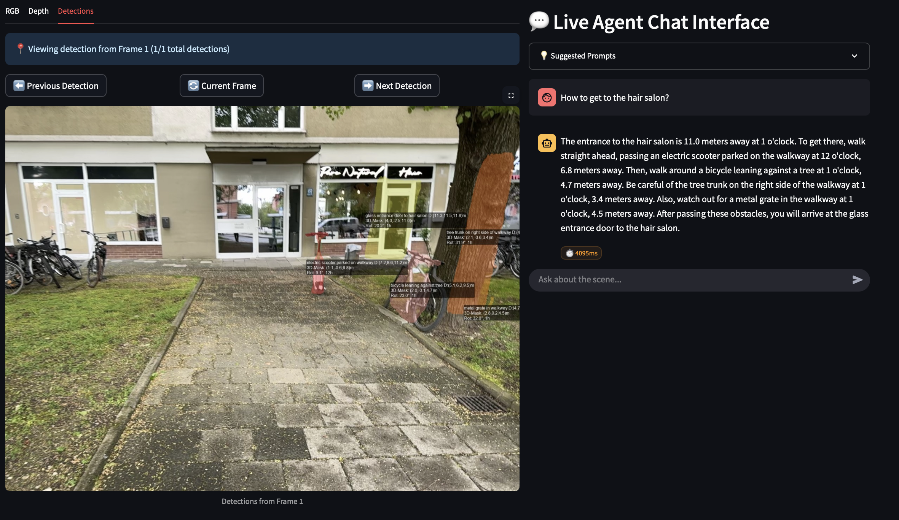

## Week 13 - June 16 - June 20, 2025

### Tasks Worked On

- **Modular Architecture**:
  - Implemented a `LiveAgentPromptTemplates` class for managing the LiveAgent's system prompt and simplify its Config.
  - Implemented enums `DirectionalStyle`, `DistanceStyle`, `ResponseStyle` to allow easy configuration of the models response style. Both provide parts for the system prompt, including examples.
  - Implemented actor protocols (Commands from User to Live Agent, Events from Agent to User or internal Live Agent communication):
    - `AskCmd`, `AudioCmd`, `SetFrameCmd` for user commands
    - `TextEvt`, `AudioEvt`, `DetectionsEvt`, `ErrorEvt` for agent responses
    - Commands / Events carry `timestamp` to allow run-time tracking of each interaction. Will be combined to get a total response time (Query -> final answer)

{#fig-week13-architecture}

**Figure**: Actor pattern architecture showing modular design with commands and events for interaction between UI and LiveAgent and within LiveAgent itself.

- Updated `Console` for structured logging with debug/verbose modes.

- **Finite State Machine**: Introduced FSM to manage multi-step interactions and hide tool chatter:
  - States: `WAIT_TOOL`, `COLLECT_FIRST`, `COLLECT_FINAL`
  - Clean separation between user-facing responses and internal "monologue" and simplify capturing the final answer.

- **Robust Depth Estimation & RANSAC**: Enhanced spatial understanding capabilities:
  - Integrated RANSAC ground plane detection for height estimation orienting on the implementation from SpatialVLM (appendix), using a standard open3d implementation.
  - Robust MAD depth filtering to reduce effect of inaccurate masks and potential sensor noise. Still not optimal, kinda ugly but works much better.
  - SE(3) transformations for relative movement descriptions and retrival of past detections in the current ego frame.
  - Enabled CodeExecution tool, such that the LiveAgent, can do spatial computations like (distance, quantitative relations between objects) on the fly.

{#fig-week13-ransac}

**Figure**: RANSAC algorithm visualization showing ground plane detection with sample points and computed normal vector.

- **Advanced Spatial Queries**: Expanded beyond single-object limitations:
  - Inter-object distance calculations
  - Height-aware descriptions using ground plane reference
  - Path planning with obstacle avoidance suggestions.

- Heavily optimized the System Prompts for both the GeiminiAABBSeg model and the LiveAgent according to recommendations in the SDK docs. Tried first person system prompts. Doesn't work well. Removed all negative instructions and examples (not recommeded). Tried to remove any redundancies (especially between system prompt and schemas).

- Did plenty of debugging and improved logging for better traceability of interactions and responses (everything asynch means can't just step through the code).

- Further Mask processing via Erosion.

{#fig-week13-3d-scene}

**Figure**: 3D scene with semi-transparent mask overlays, labeled with extents, rotation angles, and spatial relationships.

{#fig-week13-navigation}

**Figure**: Live agent providing detailed navigation instructions with 3D-masked scene visualization.

### Problems Encountered

- **Actor Communication Complexity**: Implementation was quite challenging and required iterative debug design, but works much better then without the actor pattern.

- **RANSAC Parameter Tuning**: Ground plane detection is not well tuned - same params as in SpatialVLM.

- **RANSAC**: Getting ransac to work was tricky, had some errors in the StrayDataset (incorrect rotation of camera intrinsics, sign error (y-up instead of y-down)). Coord convention: x-right, y-down, z-forward.

- **Error Handling**: Inside the live agent because of the asynchronous nature of the communication, error handling is tricky. Mostly resolved issues, some left.

### Plans for Next Week
_None_. Need to do some shit for other module as well.

### Time Spent

| Task                               | Time Spent |
|------------------------------------|-----------:|
| Architecture Refactor & Actor Pattern |  15.0 hours |
| FSM + Parsing                 |  1.0 hours |
| RANSAC & Robust Depth Estimation  |  6.0 hours |
| Data Contracts & Validation       |  3.5 hours |
| Created LaTeX equations | 1.75 hours  |
| Debugging                |  5.0 hours |
| **Total**                          | *32.25* |
