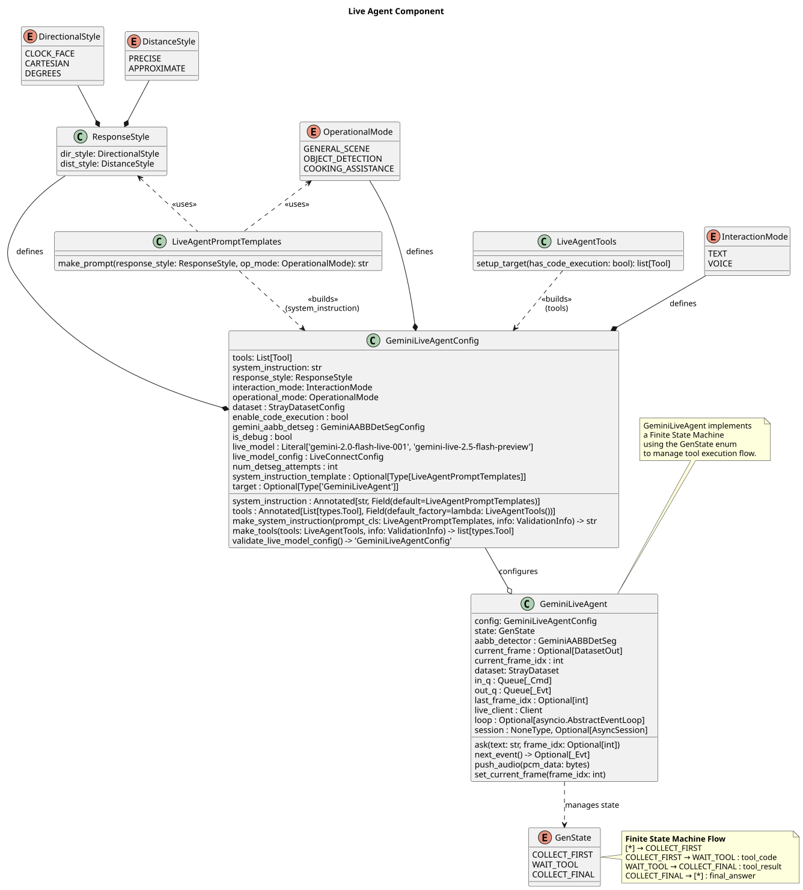
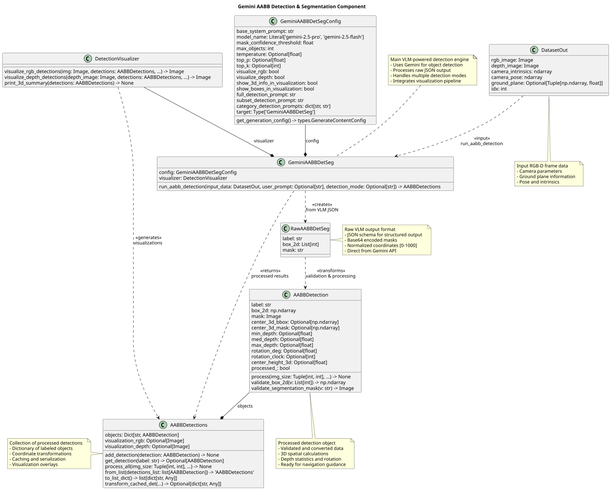
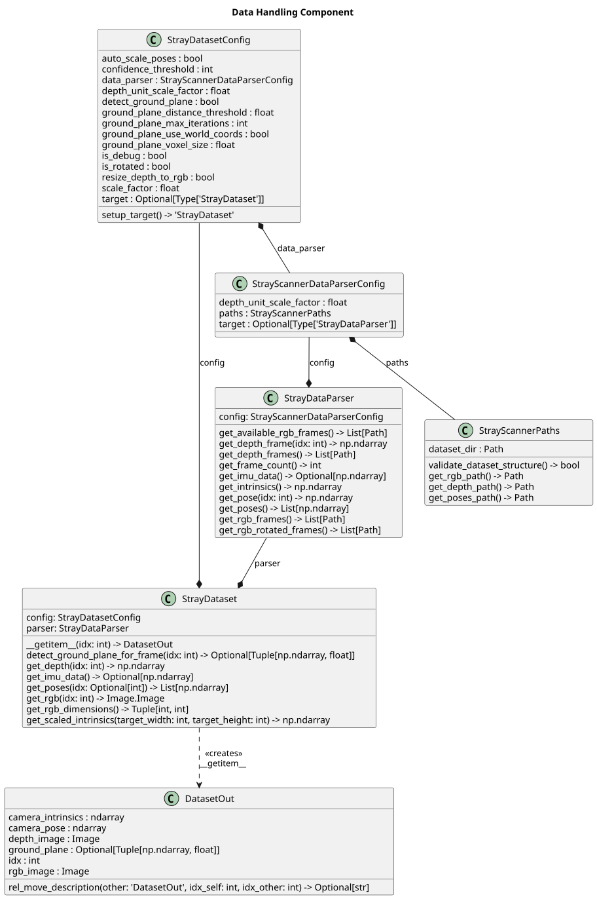
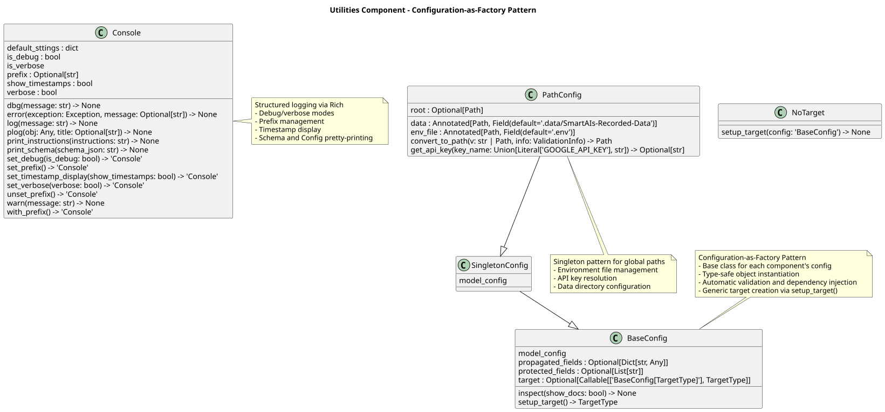

## Week 14 - June 23 - June 27, 2025

### Overview of the final SptaitalGuidance Package

- **System Updates**:

  - Updated Gemini models to latest stable versions (`gemini-2.0-flash-exp`, `gemini-2.5-pro`)
  - Enhanced model reliability and performance consistency
  - Improved live agent configuration with stable model endpoints

- **Codebase Optimization**:

  - Moved scene visualizer to `.deprecated` directory
  - Removed obsolete environment files (`env.yml`, `requirements.txt`, `setup.py`)
  - Cleaned up deprecated data contracts and unused components
  - Streamlined installation to Poetry-only dependency management

- **Documentation Enhancement**:

  - Added comprehensive repository structure to README
  - Improved installation instructions with step-by-step guidance
  - Enhanced project overview with technical specifications
  - Added UML diagrams and presentation materials to `ressources` directory

- **Final Spatial Guidance Package Architecture**: Comprehensive modular system design with five core architectural components:

{#fig-week14-packages}

*Figure: Complete package structure showing the modular organization of the spatial guidance system with clear dependency relationships.*

#### 1. Live Agent Component (`live_agent`)

**Purpose**: Real-time conversational interface with spatial awareness

- **`GeminiLiveAgent`**: Core orchestrator managing audio/text I/O, FSM state transitions, and tool execution using an actor pattern.
- **`GeminiLiveAgentConfig`**: Pydantic configuration for the live agent.
- **`actor_protocols`**: Message-passing interfaces including commands (`AskCmd`, `AudioCmd`, `SetFrameCmd`) and events (`TextEvt`, `AudioEvt`, `DetectionsEvt`, `ErrorEvt`).
- **`live_agent_config`**: Configuration-as-factory pattern with validation and model endpoint management.
- **`live_agent_enums`**: Defines interaction modes (`AUDIO`, `TEXT`), response styles (`DirectionalStyle`, `DistanceStyle`), and operational states (`GenState`, `InteractionMode`, `OperationalMode`).
- **`prompt_templates`**: System instruction generation with dynamic prompt engineering.
- **`tools`**: Function declarations for spatial queries and detection invocation.

The core class structure of the Live Agent is shown in the UML diagram below:

{#fig-week14-liveagent}
*Figure – UML class diagram of the Live Agent component, highlighting commands, events, and API orchestration.*

#### 2. Scene Understanding Component (`scene_understanding`)

**Purpose**: VLM-powered spatial perception and 3D reasoning:

{#fig-week14-gemini_aabb_detseg}
**Figure**: UML class diagram of the GeminiAABBDetSeg class and how it relates with the respectivre data contracts.

#### 3. Data Contracts Component (`data_contracts`)

**Purpose**: Type-safe data models with validation and serialization

- **`DataModel`**: A base class providing helpers for JSON schema generation and structured output parsing.
- **`RawAABBDetSeg`**: Represents the raw bounding box result returned by the Gemini model.
- **`AABBDetection`**: A processed detection containing depth, rotation, and mask data.
- **`AABBDetections`**: A collection of `AABBDetection` objects with convenience methods for manipulation.
- **`DatasetOut`**: Represents an RGB-D frame complete with camera pose and intrinsics.

**Not in use in the Live Agent**:
- **`RawOBBDetection`**: The raw oriented 3D box output from Gemini.
- **`OBBDetection`**: A processed 3D bounding box with computed vertex data.
- **`OBBDetections`**: A container for multiple `OBBDetection` instances.

#### 4. Data Handling Component (`data_handling`)
**Purpose**: RGB-D dataset management and preprocessing

- **`StrayScannerPaths`**: Resolves dataset file paths and validates the dataset directory structure.
- **`StrayScannerDataParser`**: Parses meta data, poses, odometry and filenames from a StrayScanner dataset.
- **`StrayDataset`**: Dataset that returns `DatasetOut` items.

{#fig-week14-straydata}
**Figure**: UML class diagram of the Stray data handling components

#### 5. Utilities Component (`utils`)

**Purpose**: Cross-cutting concerns and infrastructure

- **`Console`**: Structured logging with debug/verbose modes and timestamp display
- **`BaseConfig`**: Configuration-as-factory pattern with type validation and target instantiation
- **`PathConfig`**: Singleton configuration for data paths and API key management

{#fig-week14-utils}

### Plans for Next Week

- Final Report, submission preparation.
- Create final presentation with live demonstrations.
- Finalize repo docs.
