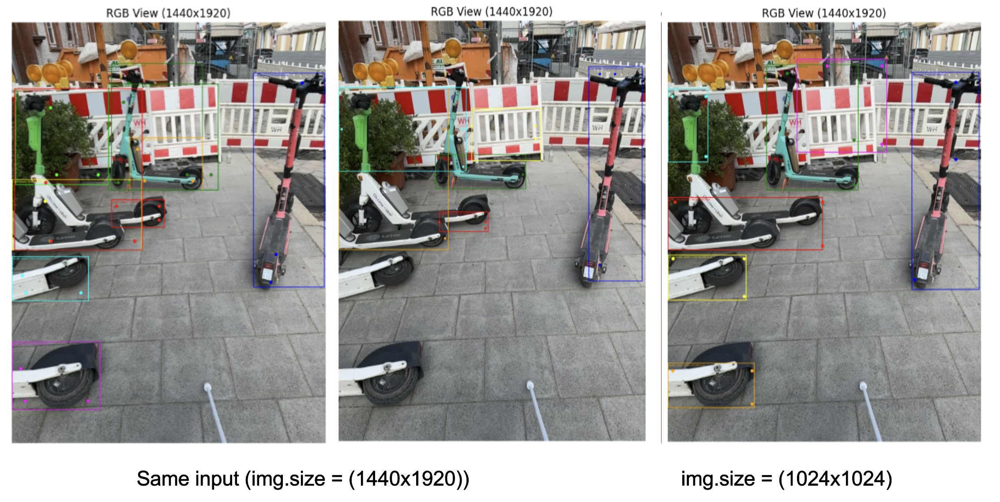
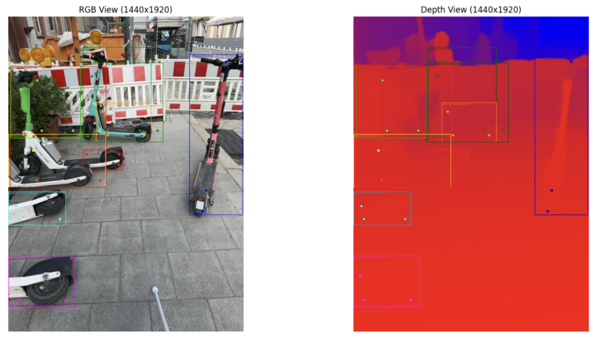

## Week 3 April 7 - April 11, 2025

### Tasks Worked On

- **StrayScanner Data Handling** ([`src/spatial_guidance/data_handling`](https://gitlab.lrz.de/dlvc04-sose-25/dlvc-04-spatial-understanding/-/tree/main/src/spatial_guidance/spatial_guidance/data_handling/stray_scanner?ref_type=heads))
  - **`StrayScannerPaths`**: Centralizes and validates all dataset paths (RGB, depth, odometry, IMU, etc.), ensuring robust file access and fallback mechanisms.
  - **`StrayScannerDataParser`**: Loads and parses all relevant StrayScanner data (RGB frames, depth maps, camera intrinsics, poses, IMU), providing a unified interface for frame-wise access and supporting both original and rotated images. This class is heavily inspired by the StrayVisualizer.
  - **`StrayDataset`**: Wraps the parser and exposes the dataset as a pipeline-ready object, handling scaling, pose normalization, and confidence filtering.
  - Added a Jupyter notebook that demonstrates parsing a sample StrayScanner recording.
- **Detection Pipeline Integration**
  - **`GeminiVLMDetection`**: Pipeline stage for running Google Gemini VLM on input frames, using structured prompts and output parsing to extract actionable scene information for navigation.
- **Development Utilities**
  - Introduced a pretty logging console and wrote initial coding guidelines.
  - Created an early ZenML pipeline example to validate the stage-based approach.
- **Prompt Engineering & Output Schema**
  - Integrated LangChain for robust output parsing and prompt management, iterating on system prompts to improve detection quality and structure.

- Read Paper [Video-3D LLM: Learning Position-Aware Video Representation for 3D Scene Understanding](https://arxiv.org/abs/2412.00493)
  - Encodes RGB video frames and encodes the pixel values based on their 3D position in the scene.
  - Does not seem to be a good fit for our project, as it creates a representation of video frames with known camera poses of a static scene, it is then capable of answering questions w.r.t.\ the overall scene constellation.

### Problems Encountered

- **Output Stochasticity**:
  - Gemini produced inconsistent results between inference runs with identical inputs
  - Bounding box locations, counts, and confidence scores varied significantly between runs without any changes to the input data.
  - Point estimates were unreliable for consistent object localization and appeared to be random within the bounding boxes.
  - Segmentation maps would provide more stable feature extraction than points or boxes provided by the VLM.
- **Image Shape Handling**:
  - Model performance appeared invariant to image shape. However, according to the Gemini cookbook, the model should work best with 1024×1024 images.
- **Complex Prompts & Output Schemas**:
  - Output quality seemed strongly correlated with complexity output schema and prompt structure, here a good deal of prompt engineering is required to optimize the model's performance.

  {fig-cap="Detection differences at various resolutions"}
  *Left & Center: Same resolution (1440×1920) but different detection results, showing model stochasticity. Right: Lower resolution (1024×1024)*

  {fig-cap="Detections overlaid on depth"}
  *Left: RGB view with bounding boxes and sampled points. Right: Depth map showing how points within AABBs often miss actual object surfaces, landing on background instead.*

### Time Spent

| Task                                | Time Spent |
|------------------------------------|------------|
| Reading paper (Video-3D LLM)       | 0.5 hours  |
| StrayScanner data handling implementation | 2.5 hours  |
| Gemini VLM detection pipeline      | 1.5 hours  |
| LangChain integration & prompt engineering | 1.0 hours  |
| Testing and debugging              | 0.5 hours  |
| **Total**                          | **6.0 hours** |