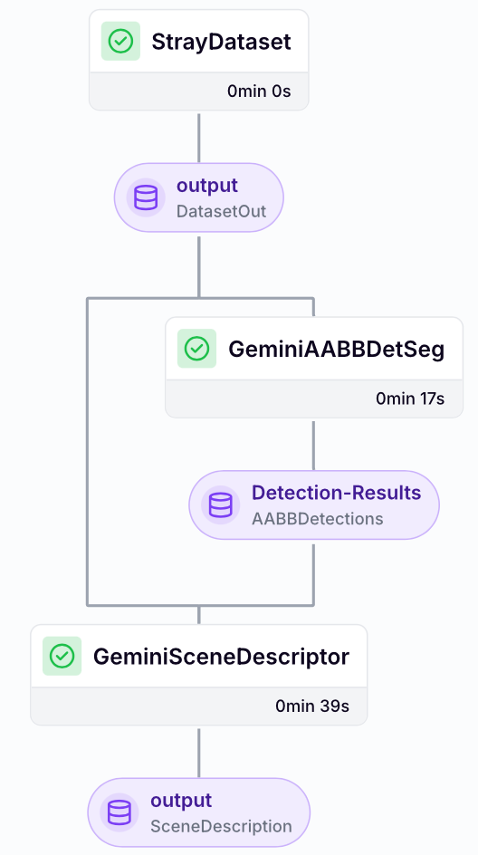

## Week 4 April 14 - April 18, 2025

### Tasks Worked On

- **Implemented Modular Pipeline Architecture**
  - Created a full [`SpatialUnderstandingPipeline`](https://gitlab.lrz.de/dlvc04-sose-25/dlvc-04-spatial-understanding/-/blob/main/src/spatial_guidance/spatial_guidance/pipeline/pipeline.py?ref_type=heads) class based on ZenML, enabling modular scene understanding
  - Designed strongly typed interfaces between pipeline stages using Pydantic models
  - Developed custom PipelineStage base class that allows easy configuration and instantiation of pipeline stages

{fig-cap="ZenML pipeline overview"}
This image shows the resulting pipeline, whose stages, as well as their inputs, outputs and configurations can be easily explored in the ZenML UI.

- **Created Robust Data Contracts**
  - Implemented a few `DataModel(pydantic.BaseModel)` classes to define data contracts between pipeline stages.
  - Implemented proper typing for all stages (`PipelineIn`, `DetectionStageOut`, via generics)
  - Created visualization interfaces that support both RGB and depth data

- **Implemented Config-as-Factory Pattern**
  - Each component follows a strictly-typed configuration pattern that validates parameters
  - Created factory methods (`setup_target()`) to instantiate components from validated configs
  - Enabled easy swapping of modules through configuration without code changes
- **Dockerization & Setup Improvements**
  - Added Dockerfiles and a `.dockerignore` for reproducible pipeline runs.
  - Fixed several pipeline Docker issues and updated `README.md` and `SETUP.md` accordingly.

All of the pipeline related code is located in the [`src/spatial_guidance/pipeline`](https://gitlab.lrz.de/dlvc04-sose-25/dlvc-04-spatial-understanding/-/tree/main/src/spatial_guidance/spatial_guidance/pipeline?ref_type=heads) folder.

- **Pipeline Integration Testing**
  - Implemented tests to validate the end-to-end pipeline functionality
  - Ensured proper artifact handling between pipeline stages

### Problems Encountered

- **ZenML Framework Complexity**:
  - Complex integration patterns for a relatively straightforward pipeline
  - Limited documentation with few comprehensive examples to follow
  - Needed significant time to understand proper artifact handling
While I certainly learned quite a bit about ZenML, and appreciated its value in ML ops, I again made the mistake to over-engineer something that could have been done much simpler.

- **Serialization Challenges**:
  - Each stage I/O needs proper serialization/deserialization
  - Standard serializers couldn't handle Pydantic models with numpy arrays, and also failed quite often in case of passing multiple arguments of different types (that by themselves should be serializable)
  - Implemented a custom `PydanticNumpyMaterializer` to address these limitations - [`materializer.py` in the repo](https://gitlab.lrz.de/dlvc04-sose-25/dlvc-04-spatial-understanding/-/blob/main/src/spatial_guidance/spatial_guidance/pipeline/materializer.py?ref_type=heads)

- **Type System Overhead**:
  - Aiming for generic but strictly typed interfaces created significant complexity
  - Needed to balance type safety with practical implementation concerns

Well, I certainly learned that test-driven development is not just a buzzword. While, SOTA LLMs often suck hard when it comes to "development", they sure are great at generating test cases, and resolving issues that arise when running them.

### Plans for Next Week

- Read Paper [Spatial VLM: Endowing Vision-Language Models with Spatial Reasoning Capabilities](https://arxiv.org/abs/2406.13642) - maybe get it running !?
- Implement a zero-shot segmentation stage to allow robust depth extraction.
- Fix and implement a few things in the pipeline (e.g. retrieving output data from the artifact store)
- Explore Grounded Segment Anything (GSAM) for segmentation tasks.

### Time Spent

| Task                                | Time Spent |
|------------------------------------|------------|
| Pipeline development and implementation | 4.0 hours  |
| Debugging and testing                  | 3.0 hours  |
| Development Diary (for 3 weeks [^1]) | 0.75 hours  |
| **Total**                              | **7.75 hours** |

​[^1]: Due to depression related procrastination, or simply laziness. Yikes.
